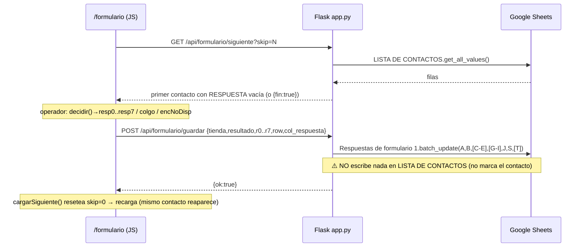

# Matriz de flujo — Formulario de Llamadas (contrato de integración Plan 3/4)

**Fecha:** 2026-08-13 · **Plan:** 2 (`plan2/evaluacion-formulario`) · **Fuente:** `app.py` (backend `~2761-2987`, frontend `FORMULARIO_HTML ~2990-3404`). Cada fila validada línea a línea.

> Esta matriz es el **contrato** que consumen el Plan 3 (botón "Revisará el Catálogo" → cola de envío) y el Plan 4 (botón "Correo" → columna T de contactos). El punto de integración es la **columna J** de `Respuestas de formulario 1`, que es exactamente lo que lee `envio_catalogo.py` (col índice 9) para decidir a quién enviar catálogo.

## 1. Diagrama de secuencia (request → sheet)

## 2. Mapa de columnas escritas por `guardar_respuesta_formulario` (`app.py:2851-2864`)

| Celda | Origen | Condición de escritura |
|---|---|---|
| `A{f}` | `datetime.now()` `dd/mm/YYYY HH:MM:SS` | siempre |
| `B{f}` | `tienda` | siempre |
| `C{f}` | `r1` (opciones P1 join) | si `r1` truthy |
| `D{f}` | `r2` | si `r2` |
| `E{f}` | `r3` | si `r3` |
| `G{f}` | `r4` | si `r4` |
| `H{f}` | `r5` | si `r5` |
| `I{f}` | `r6` | si `r6` |
| `J{f}` | `col_j` (derivado, ver §3) | si `col_j` truthy |
| `S{f}` | `resultado` | **siempre** |
| `T{f}` | `r0` | si `r0` |

`f = len(col_values(2)) + 1` (última fila por columna B). **Columna F nunca se escribe.**

## 3. Derivación de `col_j` — precedencia exacta (`app.py:2838-2848`)

Orden de evaluación (el PRIMERO que aplica gana):

| # | Condición | `col_j` |
|---|---|---|
| 1 | `r7 == 'Colgo'` | `Colgo` |
| 2 | `r7 == 'Enc No Disponible'` | `Enc No Disponible` |
| 3 | `resultado == 'Enc No Disponible'` | `Enc No Disponible` |
| 4 | `r0 == 'Buzon'` | `BUZON` |
| 5 | `r0 == 'Telefono Incorrecto'` | `TELEFONO INCORRECTO` |
| 6 | `resultado == 'NEGADO'` | `No apto` |
| 7 | `resultado == 'NO COMPATIBLE'` | `No compatible` |
| 8 | `resultado == 'MARCA UNICA'` | `Marca Unica` |
| 9 | `r7` truthy (passthrough) | valor de `r7` (`Pedido` / `Revisara el Catalogo` / `Correo` / `Avance (Fecha Pactada)` / `Continuacion (...)` / `Nulo`) |
| 10 | ninguna | `''` (J no se escribe) |

## 4. Matriz de rutas botón → estado → celdas (≥14 rutas)

Notación: `resultado` (S), `r0` (T), `r7`, y `col_j` (J) resultante. `r1..r6` se escriben en C-E/G-I si el operador llegó a esa pregunta.

| # | Ruta (clics) | `resultado`(S) | `r0`(T) | `r7` | `col_j`(J) | Preguntas escritas | Nota integración |
|---|---|---|---|---|---|---|---|
| 1 | APROBADO→p0 Respondió→p1..p7→**Pedido** | APROBADO | Respondio | Pedido | `Pedido` | C-E,G-I | **Plan 3 gate T3.1:** ¿"Pedido" también envía catálogo? |
| 2 | …→**Revisará el Catálogo** | APROBADO | Respondio | Revisara el Catalogo | `Revisara el Catalogo` | C-E,G-I | **Plan 3:** dispara envío de catálogo (J leído por `envio_catalogo.py`) |
| 3 | …→**Correo** | APROBADO | Respondio | Correo | `Correo` | C-E,G-I | **Plan 4:** dispara modal de captura de email → col T de LISTA DE CONTACTOS |
| 4 | …→**Avance (Fecha Pactada)** | APROBADO | Respondio | Avance (Fecha Pactada) | `Avance (Fecha Pactada)` | C-E,G-I | — |
| 5 | …→**Continuación** | APROBADO | Respondio | Continuacion (Cliente Esperando Alguna Situacion) | `Continuacion (...)` | C-E,G-I | — |
| 6 | …→**Nulo** | APROBADO | Respondio | Nulo | `Nulo` | C-E,G-I | — |
| 7 | APROBADO→p0 **Buzón** | APROBADO | Buzon | (vacío) | `BUZON` | — | r0 gana la precedencia (paso 4) |
| 8 | APROBADO→p0 **Teléfono Incorrecto** | APROBADO | Telefono Incorrecto | (vacío) | `TELEFONO INCORRECTO` | — | Plan 3: candidato a "corrección de número" |
| 9 | APROBADO→p0 **Enc. No Disponible** | Enc No Disponible | Respondio | Enc No Disponible | `Enc No Disponible` | — | `encNoDisp()` sobrescribe `resultado` |
| 10 | APROBADO→p1..p6 **Colgó** | APROBADO | Respondio | Colgo | `Colgo` | las alcanzadas | `colgo()` en p1-p6 |
| 11 | APROBADO→p1..p6 **Enc. No Disponible** | Enc No Disponible | Respondio | Enc No Disponible | `Enc No Disponible` | las alcanzadas | ⚠️ `resultado` APROBADO se sobrescribe a Enc No Disponible en S |
| 12 | **NEGADO** (directo) | NEGADO | Respondio | (vacío) | `No apto` | — | `decidir` guarda directo con r0=Respondio |
| 13 | **NO COMPATIBLE** (directo) | NO COMPATIBLE | Respondio | (vacío) | `No compatible` | — | — |
| 14 | **MARCA ÚNICA** (directo) | MARCA UNICA | Respondio | (vacío) | `Marca Unica` | — | — |
| 15 | APROBADO→p0 **Colgó**/… | (ver nota) | — | — | — | — | `colgo()`/`encNoDisp()` disponibles desde p1; en p0 solo Respondió/Buzón/Tel.Incorrecto/EncNoDisp |

**Atajos por paso (`app.py`):** `encNoDisp()` disponible en p0 (L3071) y p1-p6 (L3094,3108,3122,3136,3151,3166); `colgo()` disponible en p1-p6 (L3093,3107,3121,3135,3150,3165), **no** en p0.

## 5. Hallazgos que la matriz revela (para el PR / owner)

- **B-FLOW-1 (HIGH funcional):** tras `guardar`, el contacto **no se marca** en LISTA DE CONTACTOS (la escritura de "Llamado" se quitó en commit `e84c1a0`; `marcar_contacto_procesado` es código muerto). `cargarSiguiente()` resetea `skip=0` → el **mismo contacto reaparece**. El operador debe usar "Saltar" (skip++) para avanzar, lo que es frágil. → Pregunta al owner: ¿cuál es el mecanismo esperado de avance de cola?
- **B-FLOW-2 (contrato Plan 3/4):** los botones "Revisará el Catálogo", "Correo" y "Pedido" se distinguen únicamente por `r7`/`col_j`. Plan 3 y Plan 4 deben enganchar en el `resp7(v)` del JS y/o leer la columna J. El valor exacto es `Revisara el Catalogo` (sin acento) y `Correo`.
- **B-FLOW-3 (dato):** `resultado` (S) puede quedar en `Enc No Disponible` aunque la decisión inicial fuera APROBADO (rutas 9/11), porque `encNoDisp()` sobrescribe `O.resultado`.
- **B-FLOW-4 (payload muerto):** el cliente envía `row` y `col_respuesta`; el backend los ignora por completo.
